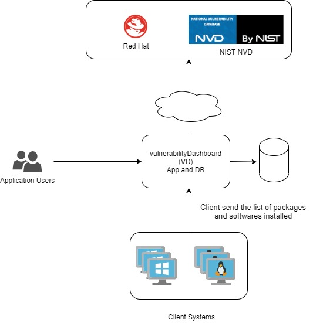
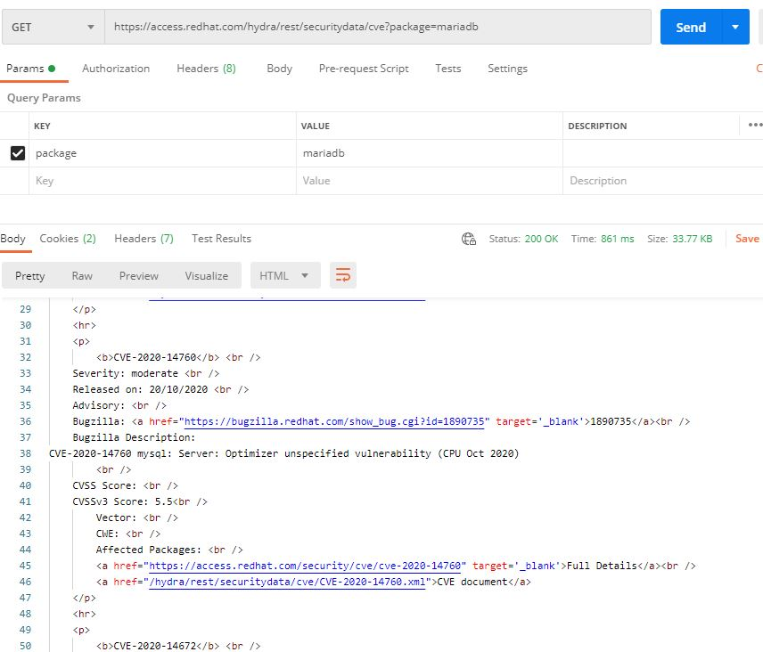

# vulnerabilityDashboard


vulnerabilityDashboard (VD) is an open source security auditig utility. 

It works by collecting inventory of softwares and packages installed on remote infrastructure endpoints (Windows 10, all editions of Windows Server and
Red Hat linux are supported for now) and use publicly available vulnerability feeds to do a vulnerability asssessment of the installed packages.   It provides users with the ability to do a Risk Assessment of their infrastructure

Thus, using one of the core functionnalities of vendor security solutions used by security engineers, and penetration testers (and non-ethical hackers...)


## Basic System Diagram


## Input Example :
### How to read a Linux package
example : subscription-manager-1.24.42-1.el7.x86_64  
(separate at the "-")  
Package Name : subscription-manager  
Package Version : 1.24.42  
Package Release : 1.el7  
Package Architecture : x86_64  
(Package Type : implied. Always RPM for a Fedora / CentOS or Red Hat system)  


#### Windows Software 
On a Windows System, open powershell  
Open powershell and type   
```powershell
Get-WmiObject -Class Win32_Product
```

```powershell
IdentifyingNumber : {6AD2231F-FF48-4D59-AC26-405AFAE23DB7}
Name              : ManageEngine Desktop Central - Agent
Vendor            : ZohoCorp
Version           : 10.0.633.W
Caption           : ManageEngine Desktop Central - Agent

IdentifyingNumber : {1B1CFE9F-D421-4193-ACB8-FDE4D565C715}
Name              : Oracle VM VirtualBox 6.1.14
Vendor            : Oracle Corporation
Version           : 6.1.14
Caption           : Oracle VM VirtualBox 6.1.14
```
### Linux packages 
On a red hat system, open CLI and type :
```bash
rpm -qa 
```
```bash
irqbalance-1.0.7-12.el7.x86_64
python-six-1.9.0-2.el7.noarch
libldb-1.5.4-1.el7.x86_64
libxcb-1.13-1.el7.x86_64
python-backports-1.0-8.el7.x86_64
redhat-release-server-7.9-5.el7_9.x86_64
python-inotify-0.9.4-4.el7.noarch
gpg-pubkey-352c64e5-52ae6884
glibc-common-2.17-317.el7.x86_64
gpg-pubkey-04bbaa7b-4c881cbf
openssl-libs-1.0.2k-21.el7_9.x86_64
....
```

## Example of querying the Red Hat Vulnerability Database
Base URL : https://access.redhat.com/hydra/rest/securitydata/cve

Documentation : https://access.redhat.com/documentation/en-us/red_hat_security_data_api/1.0/html-single/red_hat_security_data_api/index

Browsing all vulnerabilities (CVEs) affecting mariadb package (regardless of version).
This needs to be further processed to collect CVEs only affecting the current installed number and not all history, via leveraging either :
- Leverage parameters in the GET request
- Locally store in VD Database all vulnerabilities affecting packages known to be installed. Then, locally process to extract only the CVEs associated with the installed version number



